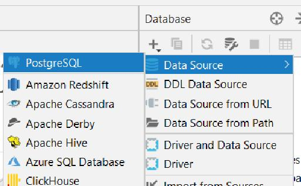
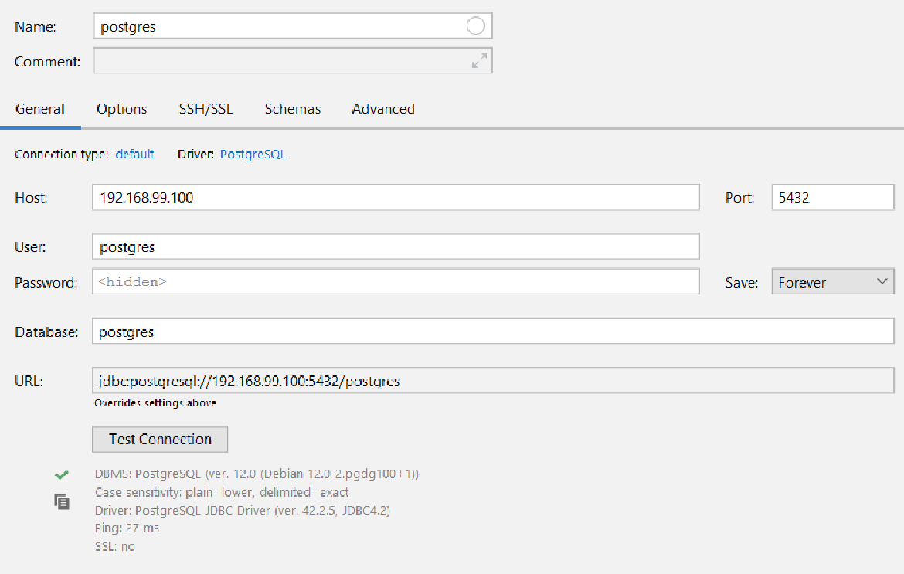
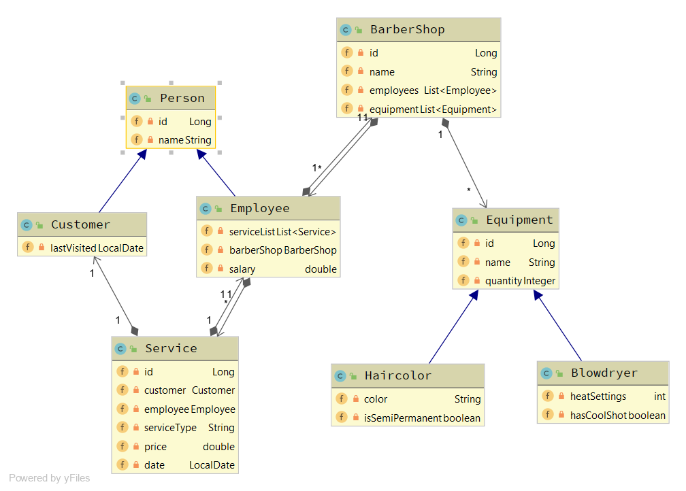
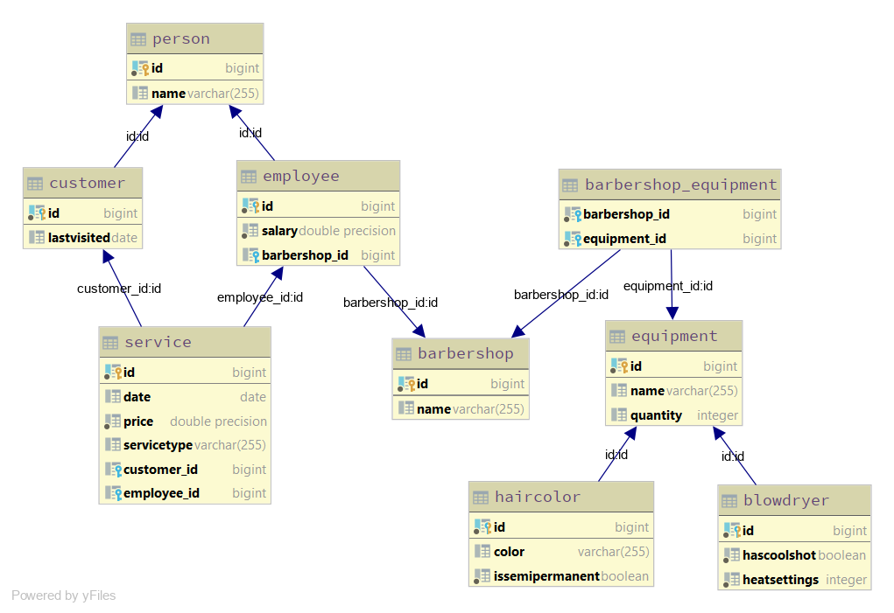
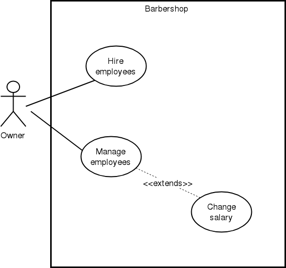

= 03-Quarkus-panache-nicoVasq
:toc:

== About
This project is reimplementation of the 'Barber' project from exercise 01.
The Hibernate ORM with *Panache* is now being used.

The 'Barber' project is about managing BarberShops with their employees/customers
and their equipment _- see diagrams_

== Running the project
*Running in Dev-Mode*

`mvn compile quarkus:dev`

*Starting the Docker-Container: Database*

`docker run --name postgres -p 5432:5432 -e POSTGRES_PASSWORD=passme -d postgres`

*Adding IDE database connection*

*user*: postgres | *password*: passme

[source]
 // Docker Toolbox
 jdbc:postgresql://192.168.99.100/postgres

 // Otherwise..
 jdbc:postgresql://localhost/postgres

== API
`http://localhost:8080`

`*/barbershop*`

* GET `/barbershop{name}` +
    Produces: application/json

* GET `/barbershop` +
    Produces: application/json

* DELETE `/barbershop/{name}` +
    Consumes: application/json +
    Produces: application/json

* POST `/barbershop` +
    Consumes: application/json +
    Produces: application/json

`*/employee*`

* GET `/employee` +
    Produces: application/json

* GET `/employee/{name}` +
    Consumes: application/json +
    Produces: application/json

* POST `/employee` +
    Consumes: application/json +
    Produces: application/json

* PUT `/employee` +
    Consumes: application/json +
    Produces: application/json

* DELETE `/employee/{name}` +
    Consumes: application/json +
    Produces: application/json

== Diagrams

=== CLD

=== ERD

=== Use-Case Diagram
Use-case for hiring employees and (for example) raising/lowering their salary

== Panache

=== Getting started
The first step is to add the Panache dependency to the _pom.xml_
[source,xml]
<dependency>
    <groupId>io.quarkus</groupId>
    <artifactId>quarkus-hibernate-orm-panache</artifactId>
</dependency>

For defining entities, annotate entities with `@Entity` and make them extend `PanacheEntity`.
_Example:_
[source,java]
@Entity
public class BarberShop extends PanacheEntity {
    ...
}

=== Features

==== Queries
Panache features a lot of  *query functions*. These functions are much more compact and easy to use
than for example *NamedQueries*.

NamedQuery:
[source,java]https://xxx[]
@NamedQueries({
    @NamedQuery(name = "BarberShop.findAll", query = "select b from BarberShop b"),
    @NamedQuery(name = "BarberShop.findByName", query = "select b from BarberShop b where b.name = :NAME")
})

Panache-Query functions:
[source,java]
public static List<BarberShop> findAllBarbershops(){
    return listAll();
    //return findAll().list();
}
public static BarberShop findByName(String name){
    return find("name", name).firstResult();
}

`listAll()` returns all  entities from BarberShop as a list. (An alternative is `findAll().list();`)
With `find("name", name)` we can filter for entities with a certain name.

==== Useful operations

Create, persist
[source,java]
BarberShop shop = new BarberShop("Klipp")
//persist it - No EntityManager needed
shop.persist();
//check if it is persistent
if(shop.isPersistent()){
    ...
}

Delete
[source,java]
 //deletes shop entity
shop.delete()
//deletes a BarberShop entity by name
BarberShop.delete("name", shopName);
//deletes all BarberShop entities
BarberShop.deleteAll();

List, Stream
[source,java]
 //returns all BarberShop entites as a list
List<BarberShop> shopList = BarberShop.listAll();
//returns a list of BarberShop entities filtered by name
List<BarberShop> shopList = BarberShop.list("name", shopName);

 //All list methods have equivalent stream versions

